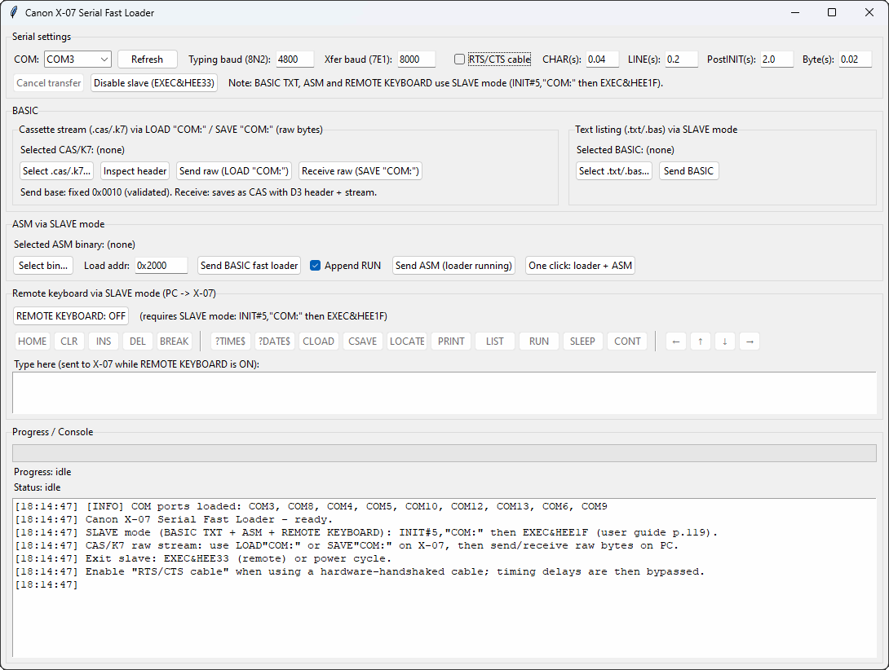

# Canon X-07 Serial Fast Loader (GUI)



## 🇫🇷 Français

### Présentation

Cet outil, basé sur une interface graphique **Tkinter**, permet de transférer des programmes vers un **Canon X-07** à l’aide d’un câble **série**.

Il propose deux modes principaux :

* **Envoi BASIC « lent »** : le programme saisit (« tape ») un fichier `.txt` ligne par ligne en **8N2**, ce qui garantit une compatibilité maximale avec la saisie BASIC du X-07.
* **Fast loader + transfert ASM** : le programme envoie d’abord un petit loader BASIC, puis transfère un binaire `.bin` beaucoup plus rapidement en basculant en **7E1**.

L’outil intègre :

* une console de logs avec horodatage `[hh:mm:ss]`,
* des barres de progression pour BASIC et ASM,
* un bouton d’annulation permettant d’interrompre proprement un transfert en cours.

---

### Prérequis

* Python 3.10 ou plus récent (recommandé)

---

### Matériel requis

* Canon X-07 fonctionnel
* Adaptateur USB ↔ série reconnu par le système (port COM sous Windows) ou câblage série conforme pour le X-07 (RX, TX, GND, etc.)

---

### Utilisation rapide

Lancer l’application :

```bash
python x07_loader.pyw
```

1. Sélectionner le **port COM** dans la section *Serial settings* (aucun port n’est sélectionné par défaut).
2. (Optionnel) Envoyer un programme BASIC `.txt` via **Send BASIC (.txt)**.
3. Pour un transfert rapide :

   * Cliquer sur **Select bin…** et choisir un fichier `.bin`.
   * Renseigner **Load address** (par exemple `0x1800`).
   * Cliquer sur **Send BASIC fast loader**.
   * Puis cliquer sur **Send ASM binary (expects BASIC loader running)**,
     ou utiliser directement **Send fast loader + ASM (one click)**.

---

### ⚠️ Mode « Slave » du Canon X-07 (obligatoire avant tout transfert série)

Conformément à la documentation officielle du Canon X-07 (guide de l’utilisateur, page 119), **le X-07 doit être placé en mode “slave” pour la réception de données via le port série**.

Dans ce mode, le périphérique série (`COM:`) devient la **source d’entrée console**, et le clavier local est ignoré. Le Canon X-07 peut alors être entièrement contrôlé à distance via la liaison RS-232C.

#### Entrée en mode slave

À saisir depuis le clavier du Canon X-07 :

```basic
INIT#5,"COM:
EXEC&HEE1F
```

Effet :

* le clavier du X-07 est désactivé,
* les caractères reçus sur le port série sont traités comme des frappes clavier.

#### Sortie du mode slave

Deux méthodes sont possibles :

1. Redémarrer le Canon X-07 (coupure puis remise sous tension).
2. Envoyer la commande suivante **depuis le port série** :

```basic
EXEC&HEE33
```

Remarques importantes :

* Le bouton **Disable slave mode (EXEC&HEE33)** de l’outil permet de quitter ce mode à distance.
* Le fast loader BASIC envoie systématiquement `EXEC&HEE33` au début afin de garantir un état cohérent.
* Selon l’option *Append RUN*, cette commande peut également être envoyée à la fin du chargement.

---

### Adresse de chargement du programme ASM

Le champ **Load address** définit l’adresse mémoire à laquelle le binaire ASM (`.bin`) sera copié sur le Canon X-07.

⚠️ **Cette adresse doit impérativement correspondre à celle utilisée lors de la compilation du programme assembleur**.

En pratique :

* Le code ASM est assemblé avec une directive du type :

  ```asm
  ORG $1800
  ```
* Le binaire généré **suppose** que son point d’entrée et ses références internes sont valides à cette adresse.
* Si le binaire est copié à une adresse différente de celle prévue à l’assemblage :

  * les sauts (`JP`, `CALL`),
  * les accès mémoire,
  * et les données référencées
    deviendront incorrects, entraînant un comportement imprévisible ou un plantage.

Il est donc essentiel de :

* compiler le programme ASM avec l’adresse souhaitée,
* renseigner exactement la même valeur dans **Load address** avant le transfert.

---

### Détails techniques (liaison série)

* **Saisie BASIC** : 8N2 (4800 bauds par défaut)
* **Transfert rapide (loader)** : 7E1 (8000 bauds par défaut)

Le loader BASIC attend :

1. Une ligne contenant `N` (le nombre d’octets à recevoir).
2. Puis `N` lignes, chacune contenant un octet en décimal.

---

### Dépannage

* **Aucun port COM visible** : vérifier le branchement de l’adaptateur et l’installation du pilote, puis cliquer sur **Refresh**.
* **Erreur indiquant qu’aucun port COM n’est sélectionné** : sélectionner un port valide dans la liste.
* **Le Canon X-07 ne réagit pas** :

  * vérifier le câblage RX / TX / GND,
  * vérifier les paramètres série (baudrate, 8N2 / 7E1),
  * augmenter `Post INIT wait (s)` et/ou `Byte delay (s)`.
* **Transfert instable** : augmenter progressivement `Byte delay (s)` (par exemple de 0,03 à 0,06) et conserver un délai `Post INIT wait` suffisant.

---

## 🇬🇧 English

### Overview

This tool, based on a **Tkinter** graphical interface, allows programs to be transferred to a **Canon X-07** using a **serial** cable.

Two main modes are available:

* **Slow BASIC send**: a `.txt` BASIC listing is typed line by line using **8N2**, ensuring maximum compatibility with the X-07 BASIC input.
* **Fast loader + ASM transfer**: a small BASIC loader is typed first, then a `.bin` file is transferred much faster by switching to **7E1**.

The application provides:

* a console with timestamped logs `[hh:mm:ss]`,
* progress bars for BASIC and ASM transfers,
* a cancel button to safely interrupt an ongoing transfer.

---

### Requirements

* Python 3.10 or newer (recommended)

---

### Required hardware

* A working Canon X-07
* A USB-to-serial adapter recognized by the system (COM port on Windows) or proper serial wiring for the X-07 (RX, TX, GND, etc.)

---

### Quick start

Run the application:

```bash
python x07_loader.pyw
```

1. Select the **COM port** in the *Serial settings* section (no default port is selected).
2. (Optional) Send a BASIC `.txt` program using **Send BASIC (.txt)**.
3. For fast transfer:

   * Click **Select bin…** and choose a `.bin` file.
   * Set the **Load address** (for example `0x1800`).
   * Click **Send BASIC fast loader**.
   * Then click **Send ASM binary (expects BASIC loader running)**,
     or directly use **Send fast loader + ASM (one click)**.

---

### ⚠️ Canon X-07 “Slave mode” (required before any serial transfer)

According to the official Canon X-07 user manual (page 119), **the X-07 must be placed in “slave” mode before any remote control or data transfer via the serial port**.

In this mode, the serial device (`COM:`) becomes the **console input source**, and the local keyboard is ignored. The Canon X-07 can then be fully controlled remotely through the RS‑232C interface.

#### Entering slave mode

To be typed on the Canon X-07 keyboard:

```basic
INIT#5,"COM:
EXEC&HEE1F
```

Effect:

* the X-07 keyboard is disabled,
* characters received from the serial port are processed as keyboard input.

#### Leaving slave mode

Two methods are available:

1. Power the Canon X-07 off and on again.
2. Send the following command **from the serial device**:

```basic
EXEC&HEE33
```

Important notes:

* The **Disable slave mode (EXEC&HEE33)** button sends this command directly.
* The fast loader BASIC always sends `EXEC&HEE33` at the beginning to ensure a known state.
* Depending on the *Append RUN* option, the command may also be sent at the end of the process.

---

### ASM load address

The **Load address** field defines the memory address where the ASM binary (`.bin`) will be copied on the Canon X-07.

⚠️ **This address must strictly match the address used when assembling the program**.

In practice:

* The ASM source is assembled with a directive such as:

  ```asm
  ORG $1800
  ```
* The generated binary assumes that its entry point and internal references are valid at this address.
* If the binary is copied to a different address than the one used during assembly:

  * jumps (`JP`, `CALL`),
  * memory accesses,
  * and referenced data
    will become invalid, leading to unpredictable behavior or crashes.

It is therefore mandatory to:

* assemble the program with the intended load address,
* enter exactly the same value in **Load address** before transferring the binary.

---

### Serial link details

* **BASIC typing**: 8N2 (default 4800 baud)
* **Fast transfer (loader)**: 7E1 (default 8000 baud)

The BASIC loader expects:

1. A line containing `N` (number of bytes).
2. Then `N` lines, each containing one byte value in decimal.

---

### Troubleshooting

* **No COM port visible**: check the adapter connection and driver installation, then click **Refresh**.
* **Error indicating no COM port selected**: select a valid port from the list.
* **The X-07 does not react**:

  * check RX / TX / GND wiring,
  * verify serial parameters (baud rate, 8N2 / 7E1),
  * increase `Post INIT wait (s)` and/or `Byte delay (s)`.
* **Unstable transfers**: gradually increase `Byte delay (s)` (for example from 0.03 to 0.06) and keep a sufficient `Post INIT wait`.
