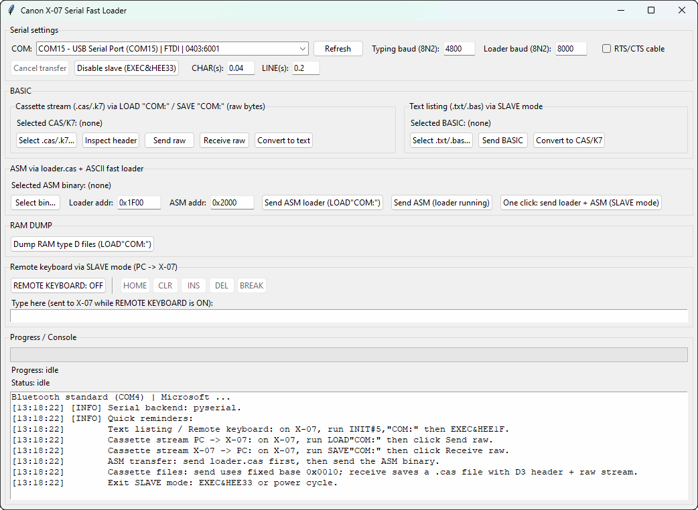

# Canon X-07 Serial Fast Loader (GUI)



## 🇫🇷 Français

### Présentation

Cet outil, basé sur une interface graphique **Tkinter**, permet de transférer des programmes vers un **Canon X-07** via une liaison **série**.

Il prend en charge :

* **BASIC (listing texte)** : envoi d’un fichier `.txt` / `.bas` en le « tapant » ligne par ligne.
* **BASIC (cassette en flux brut)** : envoi *et* réception d’un fichier `.cas` / `.k7` comme un flux d’octets via `LOAD"COM:"` et `SAVE"COM:"`.
* **ASM (rapide)** : envoi d’un petit loader BASIC, puis transfert accéléré d’un binaire `.bin`.
* **Clavier distant (REMOTE KEYBOARD)** : saisie depuis le PC et envoi immédiat des frappes / touches spéciales vers le X-07.

L’application fournit :

* une console de logs horodatée `[hh:mm:ss]`,
* une barre de progression commune,
* un bouton d’annulation pour interrompre proprement un transfert,
* des boutons de touches spéciales.

---

### Prérequis

* Python 3.10 ou plus récent (recommandé)
* `pyserial` (installé automatiquement au premier lancement si nécessaire)

---

### Matériel requis

* Canon X-07 fonctionnel
* Adaptateur USB ↔ série reconnu par le système (port COM sous Windows) ou câblage série conforme pour le X-07 (RX, TX, GND, etc.)

Optionnel :

* câble série avec **contrôle de flux matériel RTS/CTS**

Les adaptateurs USB-UART modernes (FT232, CP2102, CH340…) supportent généralement ces lignes.

⚠️ Particularité du Canon X-07 :
les lignes **RX et TX utilisent une logique inversée**, alors que **RTS et CTS ne doivent pas être inversés**.

Avec une interface **FT232RL**, cela peut être configuré avec **FT_Prog** :

```
Invert TXD : ON
Invert RXD : ON
Invert RTS : ON
Invert CTS : ON
```

⚠️ Important : résistances pull-down nécessaires sur certaines interfaces

Sur certaines interfaces USB-UART (notamment **FT232RL**), il peut être nécessaire d’ajouter des résistances **pull-down (~10 kΩ)** sur les lignes :

* **RX**
* **CTS**

Ces résistances permettent de fixer un **état logique stable** lorsque les lignes ne sont pas activement pilotées par le Canon X-07.

Sans ces résistances, certaines configurations peuvent provoquer :

* blocage de la communication série,
* pertes de caractères (notamment les retours à la ligne),
* transferts BASIC instables,
* impossibilité de démarrer correctement les transferts.

Une valeur de **10 kΩ** fonctionne généralement bien.  

---

### Lancer l’application

```bash
python x07_loader.pyw
```

1. Sélectionner le **port COM** dans *Serial settings*.
2. Ajuster si besoin :

   * **Typing baud (8N2)** : vitesse utilisée pour la saisie BASIC, le clavier distant et les flux cassette.
   * **Xfer baud (7E1)** : vitesse utilisée pour le transfert rapide ASM.
   * **CHAR(s)** / **LINE(s)** : délais (en secondes) entre caractères / entre lignes lors de la saisie BASIC.
   * **PostINIT(s)** : pause (en secondes) après bascule en mode transfert (7E1).
   * **Byte(s)** : délai (en secondes) entre octets lors de l’envoi ASM (format décimal ligne par ligne).
   * **RTS/CTS cable** : active le **contrôle de flux matériel RTS/CTS** si votre câble supporte ces lignes.

---

### Utilisation d’un câble RTS/CTS

Lorsque l’option **RTS/CTS cable** est activée :

* la communication série utilise le **hardware flow control RTS/CTS**
* les temporisations logicielles deviennent inutiles
* les champs **CHAR(s)**, **LINE(s)**, **PostINIT(s)** et **Byte(s)** sont automatiquement **désactivés (gris)** dans l’interface.

Dans ce mode :

* la synchronisation entre le PC et le Canon X-07 est assurée directement par les lignes matérielles
* les transferts sont généralement **plus rapides**
* la communication est **plus fiable**

---

### ⚠️ Mode « Slave » du Canon X-07 (requis)

Conformément à la documentation officielle du Canon X-07 (guide de l’utilisateur, page 119), **le X-07 doit être placé en mode “slave” avant tout transfert série de type “saisie clavier”**.

Le mode *slave* est requis pour :

* **BASIC texte** (`.txt` / `.bas`)
* **ASM** (fast loader + `.bin`)
* **REMOTE KEYBOARD**

Dans ce mode :

* le périphérique série (`COM:`) devient l’**entrée console**,
* le clavier local du X-07 est ignoré,
* les caractères reçus sont interprétés comme des frappes clavier.

#### Entrer en mode slave

À saisir sur le Canon X-07 :

```basic
INIT#5,"COM:
EXEC&HEE1F
```

#### Quitter le mode slave

Deux méthodes :

1. Redémarrer le Canon X-07 (OFF puis ON).
2. Envoyer depuis le port série :

```basic
EXEC&HEE33
```

Le bouton **Disable slave (EXEC&HEE33)** de l’application permet de quitter ce mode à distance.

---

# BASIC

### 1) BASIC texte (.txt / .bas) via SLAVE mode

Objectif : transférer un listing BASIC texte en le « tapant » comme si les lignes étaient saisies au clavier.

Procédure :

1. Mettre le X-07 en **SLAVE mode**.
2. Dans la section **Text listing (.txt/.bas)** :

   * **Select .txt/.bas…**
   * **Send BASIC**

Fonctionnement :

* l’outil envoie les lignes en **8N2**, avec les délais **CHAR(s)** et **LINE(s)**,
* à la fin, l’outil envoie `EXEC&HEE33` pour relâcher l’état console distant (si actif).

---

### 2) BASIC cassette stream (.cas / .k7) via LOAD "COM:" / SAVE "COM:" (raw bytes)

Objectif : échanger un programme “cassette” sous forme de flux d’octets via le port série, sans mode *slave*.

#### a) Envoyer un flux (PC → X-07) avec `LOAD"COM:"`

Côté Canon X-07 :

1. **Ne pas** être en mode slave.
2. Lancer la commande :

```basic
LOAD"COM:"
```

3. Appuyer sur **RETURN** (le X-07 attend alors le flux d’octets).

Côté PC :

1. Dans la section **Cassette stream (.cas/.k7)** :

   * **Select .cas/.k7…**
   * (optionnel) **Inspect header**
   * **Send raw (LOAD "COM:")**

Notes importantes :

* L’envoi est réalisé en **8N2**.
* Le point de départ d’envoi est **fixe** : le transfert commence à l’offset **`0x0010`** du fichier (base validée).
* Le bouton **Inspect header** affiche uniquement un **preview @0x0000** (aide au diagnostic / comparaison de fichiers).

#### b) Recevoir un flux (X-07 → PC) avec `SAVE"COM:"`

Côté Canon X-07 :

1. **Ne pas** être en mode slave.
2. Lancer la commande :

```basic
SAVE"COM:"
```

(ou `SAVE"COM:nom"` selon vos habitudes), puis **RETURN**.

Côté PC :

1. Dans la section **Cassette stream (.cas/.k7)** :

   * **Receive raw (SAVE "COM:")**
   * choisir le fichier de destination `.cas`

Fonctionnement :

* la capture se fait en **8N2**,
* l’enregistrement se termine automatiquement après une courte période d’inactivité (timeout),
* le fichier `.cas` enregistré côté PC contient :

  * un **header 16 octets** (10×`D3` + **nom sur 6 caractères** issu du nom de fichier, tronqué/paddé),
  * suivi du **flux brut** reçu depuis le X-07.

---

# ASM via SLAVE mode

Objectif : transférer rapidement un binaire assembleur `.bin`.

Principe :

1. L’outil tape un **loader BASIC**.
2. Le loader configure la liaison série côté X-07 et attend :

   * une ligne `N` (taille du binaire),
   * puis `N` lignes, chacune contenant un octet en **décimal**.
3. Le loader copie les octets en mémoire à l’adresse choisie, puis exécute le programme.

Procédure :

1. Mettre le X-07 en **SLAVE mode**.
2. Dans **ASM via SLAVE mode** :

   * **Select bin…**
   * régler **Load addr**
   * choisir :

     * **Send BASIC fast loader** puis **Send ASM (loader running)**, ou
     * **One click: loader + ASM**

### Adresse de chargement (Load addr)

Le champ **Load addr** définit l’adresse mémoire où le binaire `.bin` est copié.

⚠️ Cette adresse doit correspondre à celle utilisée à l’assemblage.

Exemple :

```asm
ORG $2000
```

Si le binaire est copié à une autre adresse que celle prévue (ORG), alors :

* les `JP` / `CALL`,
* les accès mémoire,
* et les données référencées

peuvent devenir invalides (comportement imprévisible ou crash).

---

# Remote keyboard via SLAVE mode

Objectif : contrôler le X-07 depuis le PC comme un « terminal » (frappes + touches spéciales).

Pré-requis :

1. Mettre le X-07 en **SLAVE mode**.
2. Activer **REMOTE KEYBOARD: ON**.

Fonctionnement :

* Quand **REMOTE KEYBOARD est ON**, l’application ouvre une session série persistante en **8N2**.
* La zone de saisie envoie directement les caractères ASCII imprimables.
* Les boutons envoient des **codes de touches** (HOME/CLR/INS/DEL/BREAK/flèches/etc.) conformes au X-07.

Sécurité :

* Pendant un transfert (BASIC/ASM/CAS), le clavier distant est automatiquement désactivé.

---

# Dépannage

* **Aucun port COM visible** : vérifier le branchement de l’adaptateur, l’installation du pilote, puis cliquer sur **Refresh**.
* **Impossible d’ouvrir un port COM** : essayer un autre port, vérifier que le port n’est pas déjà utilisé par un autre logiciel.
* **Le X-07 ne réagit pas (BASIC/ASM/REMOTE KEYBOARD)** :

  * vérifier que le X-07 est bien en **SLAVE mode**,
  * vérifier RX / TX / GND,
  * vérifier les paramètres (8N2 vs 7E1 selon le mode),
  * ajuster **CHAR(s)** / **LINE(s)** pour la saisie BASIC.
* **Transfert ASM instable** :

  * augmenter **PostINIT(s)**,
  * augmenter légèrement **Byte(s)**.
* **LOAD"COM:" ne charge rien (CAS/K7)** :

  * vérifier que l’envoi est déclenché après le RETURN côté X-07,
  * vérifier la cohérence du fichier et l’offset d’envoi (0x0010).
* **SAVE"COM:" ne génère rien côté PC** :

  * vérifier que vous n’êtes pas en mode *slave*,
  * cliquer sur **Receive raw (SAVE "COM:")** avant de lancer `SAVE"COM:"`,
  * vérifier le câblage et la vitesse **Typing baud (8N2)**,
  * si le programme est très court, augmenter légèrement le timeout de capture côté PC (valeur interne).
* **Problèmes avec câble RTS/CTS** :

  * vérifier que **RTS et CTS sont correctement croisés**
  * vérifier que l’option **RTS/CTS cable** est activée
  * vérifier que l’adaptateur supporte le **hardware flow control**

---

# 🇬🇧 English

### Overview

This tool, built with a **Tkinter** GUI, transfers programs to a **Canon X-07** over a **serial** link.

It supports:

* **BASIC (text listing)**: sends a `.txt` / `.bas` file by “typing” it line by line.
* **BASIC (cassette raw stream)**: sends *and* receives `.cas` / `.k7` files as raw bytes using `LOAD"COM:"` and `SAVE"COM:"`.
* **ASM (fast)**: types a small BASIC loader, then transfers a `.bin` much faster.
* **Remote keyboard (REMOTE KEYBOARD)**: sends PC keystrokes and special keys to the X-07.

The application provides:

* a timestamped log console `[hh:mm:ss]`,
* a single shared progress bar,
* a cancel button to safely stop an ongoing transfer,
* special key buttons.

---

### Requirements

* Python 3.10 or newer (recommended)
* `pyserial` (auto-installed on first run if needed)

---

### Required hardware

* A working Canon X-07
* A USB-to-serial adapter (COM port on Windows) or proper serial wiring for the X-07 (RX, TX, GND, etc.)

Optional:

* a serial cable with **RTS/CTS hardware flow control**

Modern USB-UART adapters (FT232, CP2102, CH340, etc.) usually support these lines.

⚠️ Canon X-07 specific note:
the **RX and TX signals use inverted logic**, while **RTS and CTS must NOT be inverted**.

With an **FT232RL** interface this can be configured using **FT_Prog**:

```
Invert TXD : ON
Invert RXD : ON
Invert RTS : ON
Invert CTS : ON
```

Without this inversion the communication may fail or produce transmission errors.

⚠️ Important: pull-down resistors may be required

With some USB-UART adapters (especially **FT232RL** based ones), it may be necessary to add **pull-down resistors (~10 kΩ)** on the following lines:

* **RX**
* **CTS**

These resistors ensure a **stable idle logic level** when the lines are not actively driven by the Canon X-07.

Without these resistors some setups may experience:

* serial communication blocking,
* lost characters (especially carriage returns),
* unstable BASIC transfers,
* difficulty starting serial transfers.

A value of **10 kΩ** usually works well.  

---

### Running the application

```bash
python x07_loader.pyw
```

1. Select the **COM port** in *Serial settings*.
2. Adjust if needed:

* **Typing baud (8N2)**: used for BASIC typing, remote keyboard, and cassette streaming.
* **Xfer baud (7E1)**: used for fast ASM transfers.
* **CHAR(s)** / **LINE(s)**: delays (seconds) between characters / lines when typing BASIC.
* **PostINIT(s)**: delay (seconds) after switching to transfer mode (7E1).
* **Byte(s)**: delay (seconds) between bytes during ASM sending (decimal byte lines).
* **RTS/CTS cable**: enables **RTS/CTS hardware flow control** if your cable supports it.

---

### Using an RTS/CTS cable

When the **RTS/CTS cable** option is enabled:

* the serial connection uses **hardware flow control (RTS/CTS)**
* software delays are no longer necessary
* the fields **CHAR(s)**, **LINE(s)**, **PostINIT(s)** and **Byte(s)** are automatically **disabled (greyed out)** in the interface.

In this mode:

* synchronization between the PC and the Canon X-07 is handled by hardware signals
* transfers are generally **faster**
* communication becomes **more reliable**

---

### ⚠️ Canon X-07 “Slave mode” (required)

According to the official Canon X-07 user manual (page 119), **the X-07 must be placed in “slave” mode before any serial workflow that emulates keyboard input**.

Slave mode is required for:

* **BASIC text** (`.txt` / `.bas`)
* **ASM** (fast loader + `.bin`)
* **REMOTE KEYBOARD**

In slave mode:

* the serial device (`COM:`) becomes the **console input**,
* the local X-07 keyboard is ignored,
* received characters are processed like keyboard input.

---

### Entering slave mode

Type on the Canon X-07:

```basic
INIT#5,"COM:
EXEC&HEE1F
```

---

### Leaving slave mode

Two options:

1. Power the Canon X-07 off and on again.
2. Send from the serial device:

```basic
EXEC&HEE33
```

The **Disable slave (EXEC&HEE33)** button sends this command directly.

---

# BASIC

### 1) BASIC text (.txt / .bas) via SLAVE mode

Goal: transfer a BASIC text listing by “typing” it as if entered from the keyboard.

Procedure:

1. Put the X-07 into **SLAVE mode**.
2. In the **Text listing (.txt/.bas)** section:

   * **Select .txt/.bas…**
   * **Send BASIC**

Operation:

* lines are sent in **8N2** using **CHAR(s)** and **LINE(s)** delays,
* at the end, the tool sends `EXEC&HEE33` to release the remote console state (if active).

---

### 2) BASIC cassette stream (.cas / .k7) via LOAD "COM:" / SAVE "COM:" (raw bytes)

Goal: exchange a “cassette-style” program as a raw byte stream over the serial port, without slave mode.

#### a) Sending a stream (PC → X-07) with `LOAD"COM:"`

On the Canon X-07:

1. **Do not** be in slave mode.
2. Run the command:

```basic
LOAD"COM:"
```

3. Press **RETURN** (the X-07 then waits for incoming bytes).

On the PC:

1. In the **Cassette stream (.cas/.k7)** section:

   * **Select .cas/.k7…**
   * (optional) **Inspect header**
   * **Send raw (LOAD "COM:")**

Important notes:

* Sending is done in **8N2**.
* The send starting point is **fixed**: transfer begins at file offset **`0x0010`** (validated base).
* The **Inspect header** button only displays a **preview @0x0000** (useful for diagnostics and comparison).

---

#### b) Receiving a stream (X-07 → PC) with `SAVE"COM:"`

On the Canon X-07:

1. **Do not** be in slave mode.
2. Run the command:

```basic
SAVE"COM:"
```

(or `SAVE"COM:name"` depending on your habits), then press **RETURN**.

On the PC:

1. In the **Cassette stream (.cas/.k7)** section:

   * click **Receive raw (SAVE "COM:")**
   * choose the destination `.cas` file

Operation:

* capture runs in **8N2**,
* recording automatically stops after a short inactivity timeout,
* the saved `.cas` file contains:

  * a **16-byte header** (10×`D3` + a **6-character name** derived from the output filename, truncated/padded),
  * followed by the **raw stream** received from the X-07.

---

# ASM via SLAVE mode

Goal: quickly transfer an ASM binary `.bin`.

Principle:

1. The tool types a **BASIC loader**.
2. The loader configures the serial link on the X-07 and expects:

   * one line `N` (binary size),
   * then `N` lines each containing one **decimal byte**.
3. The loader copies bytes into memory at the chosen address and executes the program.

Procedure:

1. Put the X-07 into **SLAVE mode**.
2. In **ASM via SLAVE mode**:

   * **Select bin…**
   * set **Load addr**
   * choose:

     * **Send BASIC fast loader** then **Send ASM (loader running)**, or
     * **One click: loader + ASM**

---

### Load address

The **Load addr** field defines the memory address where the `.bin` file is copied.

⚠️ This address must match the one used during assembly.

Example:

```asm
ORG $2000
```

If the binary is copied to a different address than the one defined by `ORG`, then:

* `JP` / `CALL`
* memory accesses
* referenced data

may become invalid (unpredictable behavior or crashes).

---

# Remote keyboard via SLAVE mode

Goal: control the X-07 from the PC like a “terminal” (keystrokes + special keys).

Prerequisites:

1. Put the X-07 into **SLAVE mode**.
2. Enable **REMOTE KEYBOARD: ON**.

Operation:

* When **REMOTE KEYBOARD is ON**, the application opens a persistent **8N2** serial session.
* The text entry sends printable ASCII characters.
* Buttons send **special key codes** (HOME/CLR/INS/DEL/BREAK/arrows/etc.).

Safety:

* During transfers (BASIC / ASM / CAS), the remote keyboard is automatically disabled.

---

# Troubleshooting

* **No COM port visible**: check the adapter connection and driver installation, then click **Refresh**.
* **Cannot open a COM port**: try another port and ensure it is not used by another program.
* **X-07 does not react (BASIC/ASM/REMOTE KEYBOARD)**:

  * ensure the X-07 is in **SLAVE mode**
  * check RX / TX / GND wiring
  * verify serial parameters (8N2 vs 7E1 depending on the workflow)
  * adjust **CHAR(s)** / **LINE(s)** for BASIC typing
* **Unstable ASM transfer**:

  * increase **PostINIT(s)**
  * slightly increase **Byte(s)**
* **LOAD"COM:" loads nothing (CAS/K7)**:

  * ensure streaming starts after pressing RETURN on the X-07
  * verify the file and the send offset (0x0010)
* **SAVE"COM:" produces no file content on PC**:

  * make sure you are not in slave mode
  * click **Receive raw (SAVE "COM:")** before running `SAVE"COM:"`
  * check wiring and **Typing baud (8N2)**
  * if the program is very short, increase the capture timeout slightly
* **RTS/CTS cable issues**:

  * verify that **RTS and CTS are correctly crossed**
  * ensure the **RTS/CTS cable** option is enabled
  * ensure your adapter supports **hardware flow control**
* **Communication errors**:

  * verify that **RX/TX signals are logically inverted**
  * ensure **RTS/CTS are NOT inverted**